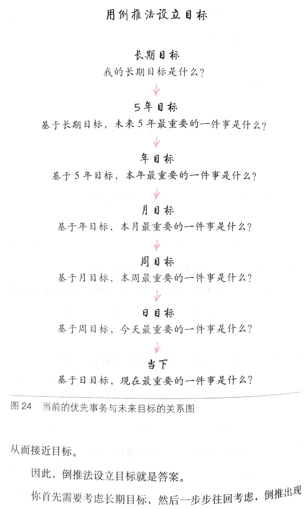
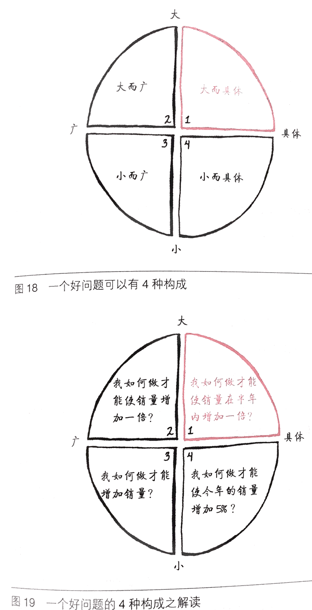
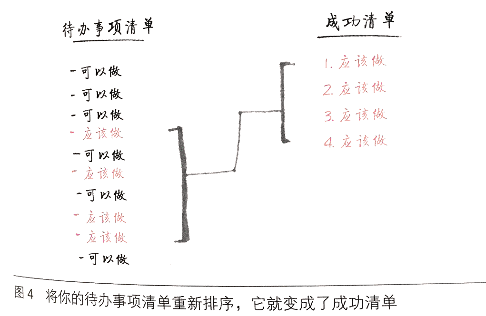
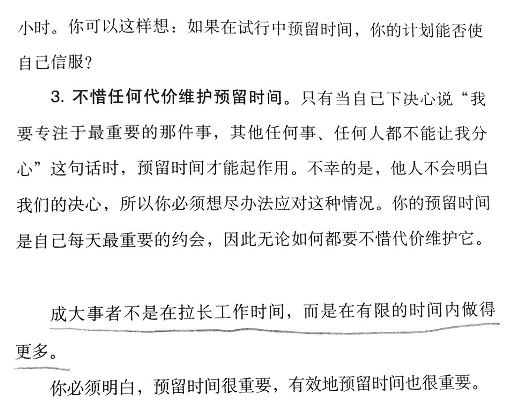

张总，你一直说有什么问题写下来，给你时间思考再回答。

有一小部分人，在不断切合实际地考虑未来，甚至没那么远，他们能考虑的只不过是今天的现实如何再明天变化。于是，他们分析问题、寻找解决方案的时候，考虑得更周全。他们知道除了某个“breaking technology”（某个有突破性进展的技术）之外，还需要很多其他方面的配套成熟。他们耐心等待，全面衡量，一旦发现明天真的就有可能变化了，就迅猛出击。

做黑脸的角色转变，工作肯定是辛苦的，有难度的、不轻松，共勉。知道问题往往没有明确的答案或唯一解决办法。摸着石头过河。
领导力：活法。。。the  one； 关键点剪下来贴墙上。

理解大目标最好，理解不了，先做。写出来哺乳动物是什么？还是一起去思考哺乳动物的智能是什么？
要答案还是提高自己的思考能力。
我明白了才去做，，还是暂时不明白也去做，还是我证明了跟大目标一致才去做？是全我想清楚，还是一起做一起想。 李笑来执行力，不喜欢能不能做好。我想的分解细化大家一起做。
pix 深度做了以后认可； cnn怎么比gan好，看了darla后，cnn和gan关系又了新的认识；
没听懂就努力想，我也要学习学习；没听懂自己努力想吧。
纯科学沟通方法。

我不做具体事情？？tensorfolw loadweight？ pip install tfgpu?? 视频预测思路理解？？
下班就撤，我找谁继续推进？我不做谁做。

确定产品应用去找技术，还是研发更强的技术去找应用和产品。
一个强人工智能或类人智能，或动物智能是万能产品。乌鸦问题有解

想清楚了怎么做，其他怎么做都没有想清楚。怎么应用也在继续想。

所以，明天（周六）的会议希望您能给我两个答案：

这两个问题是我正式提出的，我需要答案。
回答时请不要考虑让我/我们满意，我想知道您真实的想法。
如果过回答我的问题、思考让您觉得痛苦，也请不要敷衍和拒绝回答。否则就请不要创业，创业是一直伴随着痛苦和自我怀疑的。
如果你觉得时间不够或者不适合明天拿出来讨论，可以告诉一个明确的回答时间和方式，我需要正式的回答。谢谢

1. 我们的目标是什么？怎么达到。
请按照下边的方式列出来，并且再您确认回答每一个目标和重要的事前都确认，这个目标和长远目标相关，做了这件最重要的事我们就能达成目标。

zdx： 公司定位 智能公司 人工智能时代伟大的公司。
长期技术目标：最智能的智能，通用智能，
跟人智能相当的专用系统的通用智能学习系统。
跟动物智能相当的专用系统的通用智能系统。

5年：目标：知名的人工智能公司，
年利润1亿的视觉AI公司：视觉AI产品，
无人驾驶视觉感知（占有90市场）

！！公司技术研发成果：视觉感知智能非常完善，推理智能中等。

分解：做一款  视觉感知 产品
解决痛点。
满足需求
性能指标：

！！！！技术目标：视觉感知达到爬行动物的智能
分解：视觉-触觉等感知融合测试集成功能完善。

视觉感知智能非常完善：
1更多的维度-加时间监督 videogan；
2更多传感器，视听闻触等。   cyclegan
3 Progressive Growing of GANs  
4capsnet  5beta-vae distangle:bayesgan

人才需求：
市场：

个人能力提升，个人角色转变，能力提升；更多合适的能人加盟。

1年：目标,拿到孙正义投资
技术目标： 爬行动物的视觉部分功能原型验证。
提的要求是分解爬行动物的智能。

事情分解：  最重要：各个智能思路验证及应用。
功能集成效果演示，惊人效果展示，
原型验证：功能验证：更好智能：下面功能的学习-改进-应用-集成
1更多的维度-加时间监督 videogan；
2更多传感器，视听闻触等。   cyclegan
3 Progressive Growing of GANs  
4capsnet  5beta-vae distangle:bayesgan
人才：招聘深度学习 数学 程序 大牛

vid2vid 的优越性。
避障系统的实现方法： 1  2 3 4 5 

产品：无人驾驶车道认知方案：

无人驾驶的智能系统（预测能力。）

1月：目标：vid2vid 验证 视频的未来预测。

vid2vid 工程级别验证。  效果惊人
事情分解：跑起来，数据测试，
程序架构：

1周：跑起来基础vid2vid框架;
今天：vid2vid 我认为很清楚，分解： 分解- 论文参考2片；程序参考两个； d如何设计，g如何参考。

通用智能-人脑智能-视觉智能-物体概念的学习-GAN模型-路的概念-路的属性-路的方向-beta vae--

物体概念-物体不同属性的学习-多传感器联想-
通用智能-智能的发展发育，认知发展-- Progressive Growing of GANs 
时间记忆推理：videogan

朱松纯的AI思路

支付宝总裁： 。。。。要吧它变成一个正确的决定。

您的答案应该大而具体, 参考下面的例子

2. 您的重要的事的列表
请您列出您觉得您和公司当前的所有事，并分类为应该做的事、必须做的事和可以做的事。
格式参考下图：

更多人才：
公司所有人的成长
智能思路的验证

必须做的事情：通用AI视觉技术，vid2vid 
包括：更好智能：1更多的维度-加时间监督 videogan；2更多传感器，视听闻触等。   3 Progressive Growing of GANs  4capsnet  5beta-vae distangle:bayesgan
人才：
支持工作：行政财务

下面的是我看 The ONE 觉得获益最深的一句话

我们往往靠忙碌来麻痹自己的懦弱和无能，而拒绝改变，我一直时刻提醒自己。

午休占座，使用完电话通知我

有一小部分人，在不断切合实际地考虑未来，甚至没那么远，他们能考虑的只不过是今天的现实如何再明天变化。于是，他们分析问题、寻找解决方案的时候，考虑得更周全。他们知道除了某个“breaking technology”（某个有突破性进展的技术）之外，还需要很多其他方面的配套成熟。他们耐心等待，全面衡量，一旦发现明天真的就有可能变化了，就迅猛出击。

ref:傅盛：http://mp.weixin.qq.com/s/VvubfH06M8qDGs82U-5W8w
当时公司说，你先做一款口碑软件再说。尽管，方向没有那么居功至伟的前瞻性，但给了你一个封闭式问题。就做一款免费安全软件。在这个封闭式问题下，做的所有努力，已经把难度极具降低。
没有方向时，你觉得都是方向。来回探索，大量时间被消耗。但给你一个固定性问题，叫封闭式、有区间问题。难度其实大幅度下降。虽然想出了，很多产品点子，但一个选择的重要性，其实远远大于过后做出的很多努力。CEO的核心是树立一个简单可行的目标。树立一个越简单越聚焦的目标，越好。尽管这个目标，可能在过程中，不断变化。阿里巴巴的口号是“让天下没有难做的生意”，但我觉得，他的封闭式问题是什么时候销售能够超过沃尔玛。以及怎么超过沃尔玛，用怎样的方式超过沃尔玛

蔡文胜：创业时未知人  未知地点，未知的事情，开始想不清楚。
扎克伯格 决定人生高度的是做事的速度----华为 战略是打出来的。 曾鸣 战略是打磨出来的，开始的时候不清晰，更不用说业务模式 收入模式。

凡事有交代，件件有着落，事事有回音
纯科学-沟通-写下来。