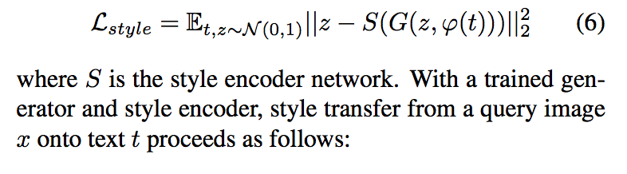

### **paper 阅读笔记**

*基于文字描述生成相应图片的GAN*


- GAN-CLS

增加一个D的loss function，为G提供新信号

> In addition to the real / fake inputs to the discriminator during train- ing, we add a third type of input consisting of real im- ages with mismatched text, which the discriminator must learn to score as fake.By learning to optimize image / text matching in addition to the image realism, the discrimina- tor can provide an additional signal to the generator.


| GAN-CLS  | real image  | fake image|
|:----- |:--------:|:----------:|
| right text | D- |  D+ |
| wrong text | **new** D+ |  -- |


- GAN-INT manifold interpolation

融合条件文字描述

> Motivated by this property, we can generate a large amount of additional text embeddings by simply interpolat- ing between embeddings of training set captions.

```
beta*t1 + (1-beta)*t2
```

- 风格迁移



```
s <- S(x), x_hat <- G(s, psi(t))
```

*x_hat* is the result image and *s* is the predicted style.

- 风格迁移的评估方法

> **ROC curves using cosine distance** between predicted style vector on same vs. different style image pairs

> To recover z, we inverted the each generator network as described in subsection 4.4. To construct pairs for verifica- tion, we grouped images into 100 **clusters using K-means** where images from the same cluster share the same style. For background color, we clustered images by the average color (RGB channels) of the background; for bird pose, we clustered images by 6 keypoint coordinates (beak, belly, breast, crown, forehead, and tail).


本质上依然是pair的conditionalGAN，特点是由pix2pix的图像表征生成转换到*文字表征*生成，由利用GAN学习图像分布，到学习文字描述映射图像的分布。

基于DC-GAN, text encoder [char-CNN-RNN](../papers/1605.05395.pdf) [http://arxiv.org/abs/1605.05395](http://arxiv.org/abs/1605.05395)

> a deep convolutional generative adversarial network (DC-GAN) conditioned on text fea- tures encoded by a hybrid character-level convolutional- recurrent neural network. 

模型现有问题，生成图像解析度小 64x64
