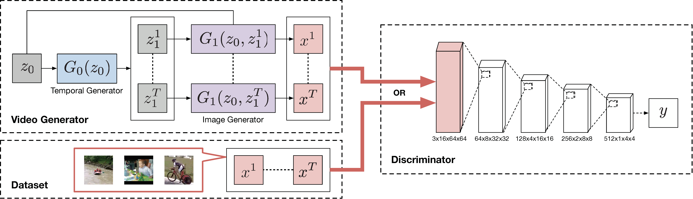
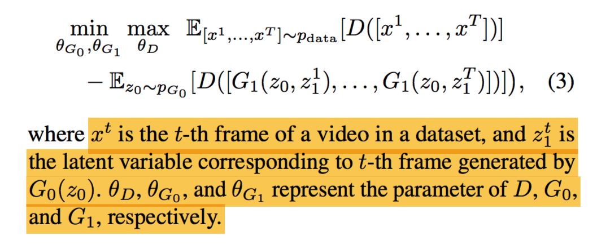

### **paper 阅读笔记**

***18-10-TGAN-生成视频的WGAN***

[Temporal Generative Adversarial Nets with Singular Value Clipping]
(http://arxiv.org/abs/1611.06624)

#### 结构

两个generator， 是序列生成器G0将单噪音Z0生成连续时间向量Z1，视频生成器再根据Z1生成时间上对应Z1的图像生成器。生成的图像进入判别器D

判别器D采用WGAN结构，修改K部分，用SVC替代产生K值的办法，增强TGAN的稳定性。

G1 DCGAN - kernal 4, sgride =2, padding =2 

